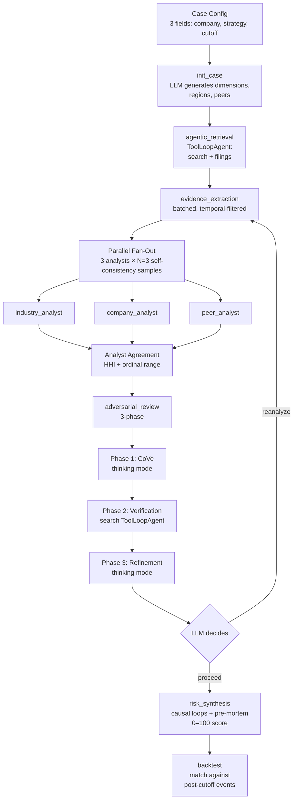

# Strategic Failure Early Warning Agent

**Multi-agent reasoning for predicting strategic failures at public companies — from public, timestamped evidence only.**

> Given only pre-May-2025 public data, the system flagged Honda's EV strategy as **HIGH-CRITICAL** and matched **7 of 9** ground-truth failure events across 3 stability runs. The same pipeline scored Toyota as **MEDIUM-HIGH** and BYD as **LOW** — correctly differentiating three companies executing three different EV strategies.

## Stability results — retrospective (cutoff 2025-05-19, 9 runs)

| Company | Mean score | Range | Level | Confidence | Backtest (3 events × 3 runs) |
|---|---:|---:|:---:|---:|:---:|
| **Honda** (target: strategy failure) | **84.7** | 79–89 | HIGH–CRITICAL | 0.71 | **7 STRONG + 2 PARTIAL / 9** |
| **Toyota** (control: executing) | **64.7** | 58–74 | MEDIUM–HIGH | 0.76 | 0 STRONG + 6 PARTIAL / 6 |
| **BYD** (control: succeeding) | **29.7** | 23–39 | LOW | 0.65 | 2 STRONG + 4 PARTIAL / 6 |

**Cross-company ordering Honda > Toyota > BYD maintained in 3/3 rounds.** Honda's 10-point range is the tightest observed across 39 iterations of development. Toyota's all-PARTIAL backtest is correct — the ground-truth events (record profits, platform announcement) aren't strategy failures, so PARTIAL is the expected match quality. A full methodology and iteration history is in [docs/iteration_log.md](docs/iteration_log.md).

See full reports without running anything:
**[Honda](demo/honda/report.html) · [Toyota](demo/toyota/report.html) · [BYD](demo/byd/report.html)**

## Forward predictions — open forecast (cutoff 2026-04-19, 9 runs)

Same pipeline, same model, same prompts — now pointed at **today's information** with no backtest to anchor it:

| Company | Mean score | Range | Level | vs retrospective | Interpretation |
|---|---:|---:|:---:|---:|---|
| **Honda** | **98.0** | 96–100 (4 pts) | CRITICAL (all 3 runs) | +13.3 | Failure confirmed by post-2025 evidence. Range collapses as evidence becomes unambiguous. |
| **Toyota** | **68.3** | 58–84 (26 pts) | MEDIUM–CRITICAL | +3.6 | Hybrid position still buffering, but SSB timeline slippage + China EV losses are visible. |
| **BYD** | **57.3** | 53–64 (11 pts) | MEDIUM–HIGH | **+27.6** | EU tariffs, domestic price-war intensification, slowing growth — risk has risen substantively. |

The **retrospective vs forward divergence is the main validation of temporal integrity**. If the system were leaking post-2025 world knowledge, the retrospective Honda score would already be near 98. It isn't — retrospective Honda is 79–89, using only pre-May-2025 evidence. Only in the forward run, when the March 2026 writedown is in-evidence, does the score converge on 96–100.

A run script for either cutoff:

```bash
# Retrospective (with backtest)
python -m sfewa.main --case configs/cases/honda_ev_pre_reset.yaml --agentic

# Forward (3-arg mode, no ground truth yet)
python -m sfewa.main "Honda Motor Co., Ltd." "EV electrification strategy" 2026-04-19 --agentic
```

## Benchmark: Claude Code on the same task

To pressure-test these results, the same forward-prediction prompt was given to [Claude Code](https://www.anthropic.com/claude-code) — a general-purpose agent harness with features SFEWA deliberately omits: sub-agents, persistent memory, TaskCreate, Plan Mode, first-party WebSearch/WebFetch. Claude Code was blind to SFEWA's scores and ran the task 3 times. Full setup: [docs/claude_code_benchmark.md](docs/claude_code_benchmark.md).

| Company | SFEWA (9 runs, mean) | Claude Code (3 runs, mean) | Δ |
|---|---:|---:|---:|
| Honda  | **98.0** CRITICAL | **79.0** HIGH   | −19.0 |
| Toyota | **68.3** HIGH     | **41.3** MEDIUM | −27.0 |
| BYD    | **57.3** MEDIUM   | **42.3** MEDIUM | −15.0 |

**What this shows:**

1. **Directional agreement on Honda is the strongest external validation.** An independent agent with different retrieval, different reasoning, different adversarial mechanics — running on a different model family — reaches the same qualitative conclusion: Honda is the highest-risk of the three. That is the signal worth keeping.
2. **SFEWA scores systematically more severe** by 15–27 points. Our Iceberg-Model depth gate plus 3-phase adversarial tend to push toward primary-strategy-failure framings. Claude Code more readily accepts balancing forces (motorcycle cash, hybrid margin, overseas growth) as mitigating. Whether that's a SFEWA bias or a Claude Code bias is an open question — neither system has ground truth for this forward window.
3. **Toyota vs BYD ordering disagrees.** SFEWA reads Toyota > BYD; Claude Code reads BYD > Toyota in 2/3 runs, citing Toyota's multi-pathway as *being vindicated* by the BEV demand plateau. Worth a deeper audit — is SFEWA's adversarial reviewer over-weighting SSB timeline slippage?
4. **Memory compresses research cost across runs.** Claude Code's R2 notes report *"6 Explore sub-agents in two parallel waves, ~120 tool calls, seeded by prior-run memory `sector_auto_ev_risk.md`"*. Direct evidence that the persistence layer liteagent doesn't implement would help — and a concrete roadmap item.

A full side-by-side methodology comparison is in [docs/claude_code_benchmark.md](docs/claude_code_benchmark.md).

---

## Why this is interesting

Most "AI for finance" demos ask an LLM to summarise a 10-K. This project does something harder: a **time-bounded, adversarially-evaluated, multi-agent reasoning pipeline** that produces an auditable risk assessment from pre-cutoff public data.

Three design choices make the cross-company discrimination real:

- **Separated evaluation.** Analysts generate risk factors. An independent adversarial reviewer, structurally isolated and run in thinking mode, challenges every factor via Chain of Verification — then runs its own web search for new counter-evidence the analysts never saw. In the stability test, BYD triggers 9+ STRONG challenges per run while Honda triggers 1; the system is *less* confident about the easy case.
- **Agentic depth routing.** Analysts apply the Iceberg Model: 4 layers of progressive deepening per risk dimension. Benign patterns stop at layer 2 (LOW). Structural risks descend to layer 4 (HIGH/CRITICAL) with pre-mortem assumption challenge. Depth itself becomes a signal.
- **Temporal integrity as a first-class concern.** Hard cutoff enforcement at retrieval, extraction, and prompt level — three redundant gates. Without this, LLMs silently leak post-cutoff world knowledge and the backtest becomes circular.

This is not a one-shot prompt. Across 8 pipeline nodes, an LLM makes 10+ autonomous routing and depth decisions per run — driven by what the evidence looks like, not by hardcoded rules.

---

## Architecture



**Planner** (retrieval) — **Generator** (3 parallel analysts) — **Evaluator** (3-phase adversarial) — **Synthesizer** (continuous score) — **Validator** (backtest).

Built on `liteagent` (vendored) — a ~1000-line alternative to LangChain: utilities for LLM orchestration, parallel fan-out, tool-loop agents, structured output parsing, and observability. No graph DSL, no framework-owned runtime, plain Python functions you can read top-to-bottom. See [docs/liteagent_architecture.md](docs/liteagent_architecture.md).

Full system design: [docs/architecture.md](docs/architecture.md).

---

## Case study: Honda EV strategy

Honda announced aggressive 2030 EV targets in 2024: 30% EV/FCEV, 10 trillion yen. By May 2025, targets were revised down to 20% / 7T yen. By March 2026, Honda cancelled multiple North American EV models and recorded ~2.5 trillion yen in losses.

**The question the system answers**: using only pre-May-2025 public data, could you have flagged this?

**Result**: `HIGH-CRITICAL` risk, 7 STRONG backtest matches across 3 runs. Score driven by structural factors — $4.48B EV segment losses against a 10T yen commitment, delayed NA market entry, 4:1 volume disadvantage vs BYD — each traced to timestamped evidence with source attribution.

Full narrative: [demo/honda/risk_memo.md](demo/honda/risk_memo.md). Full LLM call audit trail: [demo/honda/llm_history.jsonl](demo/honda/llm_history.jsonl).

---

## Quickstart

### 1. View cached demo outputs (no setup)

```bash
open demo/honda/report.html    # or toyota/ byd/
```

Self-contained HTML (1.5 MB each) with interactive risk factors, evidence table, challenge annotations, pipeline event timeline, and full LLM call inspector. Works offline.

### 2. Run the pipeline yourself

```bash
# Install
uv sync

# Configure LLM backend
cp .env.example .env
# Edit .env — point DEFAULT_BASE_URL at your LLM endpoint

# Run a new case with just 3 arguments (LLM generates regions/peers)
PYTHONPATH=src uv run python -m sfewa.main \
    "Apple Inc." "AI product strategy" 2026-04-19 --agentic

# Or run a YAML-defined retrospective case (with ground-truth backtest)
PYTHONPATH=src uv run python -m sfewa.main \
    --case configs/cases/honda_ev_pre_reset.yaml --agentic

# Run tests
PYTHONPATH=src uv run pytest
```

**YAML vs 3-arg mode**: YAML is only needed for retrospective cases that encode `ground_truth_events` for backtest validation. For real-world forecasts (no known outcome yet), the 3-arg mode is the canonical interface — `init_case` derives regions, peers, and analysis dimensions from the company name.

### 3. LLM backend options

SFEWA uses the OpenAI-compatible protocol. Any of these work by changing `.env`:

| Backend | Setup | Notes |
|---|---|---|
| **vLLM (default)** | Serve `Qwen/Qwen3.5-27B-GPTQ-Int4` with `--enable-auto-tool-choice` | ~32 GB VRAM. Results in this README used this. |
| **Ollama** | `ollama serve`; `DEFAULT_BASE_URL=http://localhost:11434/v1` | Tool-calling needs recent Ollama + compatible model. |
| **OpenAI** | `DEFAULT_BASE_URL=https://api.openai.com/v1`; set `DEFAULT_API_KEY` | ~$2–5 per full pipeline run with `gpt-4o`. |

Qwen3.5 was chosen for reproducibility and the thinking / non-thinking mode split — no closed-weight dependency, no per-token cost.

---

## Project structure

```
src/liteagent/       # 10-module agent framework (~1000 LOC)
  llm.py             #   LLM client (OpenAI-compatible)
  agent.py           #   ToolLoopAgent (while-tool-call loop)
  pipeline.py        #   merge_state, run_parallel, loop_until
  observe.py         #   CallLog + Reporter protocol
  ...

src/sfewa/
  graph/pipeline.py  # 8-node pipeline (v2, --agentic)
  agents/            # One file per node
    agentic_retrieval.py
    _analyst_base.py          # Iceberg Model + self-consistency sampling
    adversarial.py            # 3-phase: CoVe + search + refinement
    risk_synthesis.py         # Programmatic base + LLM adjustment
    ...
  prompts/           # Prompt templates (not inline strings)
  schemas/           # Pydantic + TypedDict schemas
  tools/             # DuckDuckGo, EDINET, CNINFO clients

configs/cases/       # Honda, Toyota, BYD retrospective case configs
demo/                # Pre-cached runs for immediate review
docs/                # Architecture, iteration log, cross-company results
tests/               # 51 tests (all pass in <1s)
```

---

## What makes this different from a typical LLM app

| Dimension | Typical LLM app | SFEWA |
|---|---|---|
| Analysis dimensions | Hardcoded in prompt | LLM generates dimensions from case context |
| Evidence retrieval | One search, take top-k | ToolLoopAgent self-assesses coverage across 9 criteria, stops when satisfied |
| Analysis depth | Same depth everywhere | Iceberg Model: LLM routes depth 2–4 per dimension based on what it finds |
| Evaluation | Same agent self-checks | Structurally separated adversarial reviewer, different mode, 3 phases, independent web search |
| Severity calibration | Fixed categorical labels | Emerges from depth + structural forces + 7 programmatic consistency flags |
| Reliability | Single LLM call | Self-consistency N=3 with modal severity, dynamic early-stop |
| Citation integrity | Trust analyst output | Programmatic phantom + stance-mismatch detection |
| Confidence | Verbalized by LLM | Empirical analyst agreement (HHI concentration, ordinal range) |
| Observability | Pray | Every LLM call + tool call + pipeline event logged to JSONL |
| Validation | Unit tests | 39 iterations of 9-run cross-company stability tests |

Each iteration documents the problem, the design change (structural > reasoning framework > prompt tuning, in that order), pre/post stability numbers, and what was learned. See [docs/iteration_log.md](docs/iteration_log.md).

---

## Documentation

- **[Architecture](docs/architecture.md)** — System design, node contracts, Iceberg Model, 3-phase adversarial, state management
- **[liteagent Architecture](docs/liteagent_architecture.md)** — Framework design, module map, patterns encoded, comparison vs LangChain/LangGraph
- **[Cross-Company Results](docs/cross_company_results.md)** — Honda / Toyota / BYD risk profiles, evidence stance distributions, backtest details
- **[Iteration Log](docs/iteration_log.md)** — All 39 iterations: what we tried, what we learned, what we changed

---

## What this is not

- Not a stock predictor or trading signal
- Not a general-purpose chatbot
- Not a full-market scanner
- Not an unconstrained AI opinion

This is an **auditable research workflow** where every conclusion traces to timestamped, source-attributed evidence, and every conclusion has been independently challenged.

## License

MIT. See [LICENSE](LICENSE).
