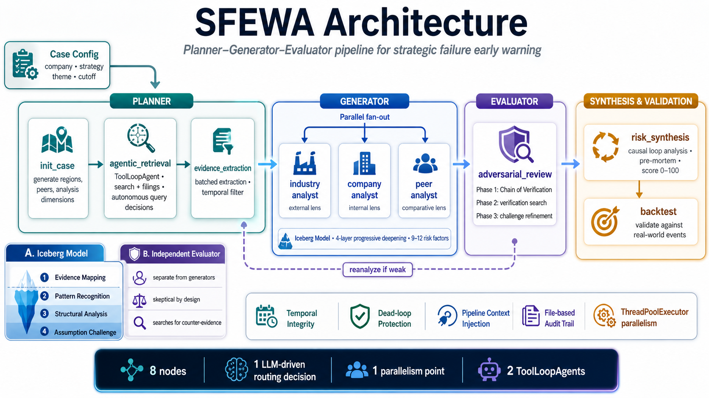
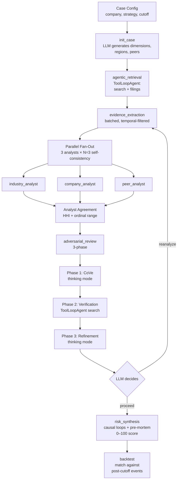

# Strategic Failure Early Warning Agent

### An agent-harness engineering study — reference implementation in ~1,000 LOC


---

## Thesis

> **Agent = Model + Harness.** Models are commoditizing; harnesses aren't.

The *agent harness* is everything around the model: the controlled tool-loop, the tool registry, the state machine, memory, permissions, context management, the observability layer, and the analytical scaffolding that turns raw LLM calls into reliable autonomous behavior. The term is now standard — [Martin Fowler frames harness engineering as the primary driver of agent performance variance](https://martinfowler.com/articles/harness-engineering.html), [Parallel Web Systems defines it as the full infrastructure that gives the model "hands, eyes, memory, and safety boundaries"](https://parallel.ai/articles/what-is-an-agent-harness), and [OpenAI coined the discipline](https://www.decodingai.com/p/agentic-harness-engineering) after shipping ~1M lines of production code with a small team behind a carefully engineered Codex harness.

This project is a hands-on study in harness design. It ships two things:

- **`liteagent`** — a ~1,000-line harness toolkit (10 modules, 1 external dependency). Utilities, not a runtime. No graph DSL, no framework-owned execution loop, plain Python functions you can read top-to-bottom.
- **`sfewa`** — a domain application built on `liteagent` that pressure-tests the harness on a real prediction task: flag a public company's strategic failure from timestamped pre-cutoff evidence.

The headline result: using only pre-May-2025 evidence, the harness flagged **Honda's EV strategy as HIGH–CRITICAL**. Ten months later, Honda cancelled its North American EV lineup and took ~2.5 trillion yen in writedowns. The same harness rated **Toyota MEDIUM–HIGH** (executing hybrid-first) and **BYD LOW–MEDIUM** (the world's largest NEV maker, strategy succeeding).

**The core claim is not *"an LLM can predict Honda."* The core claim is that with a deliberately designed ~1,000-line harness and disciplined evidence hygiene, a commodity open-weight model can produce a differentiated, auditable, reproducible risk assessment — and the differentiation lives in the harness, not the model.**



The shape of the system at a glance: four pipeline stages (Planner → Generator → Evaluator → Synthesis & Validation), two analytical scaffolds (Iceberg Model 4-layer deepening on the Generator, Independent Evaluator on the Evaluator), and four harness-level concerns that cut across every node. The result tables below are what this pipeline produced; [the Architecture section](#architecture) walks through the nodes and the LLM-driven routing edge.

---

## Stress test — Honda / Toyota / BYD

### Retrospective (cutoff 2025-05-19 — ground truth known)

Two independent samples on the same case configs, two different open-weight models. The harness is identical; only `DEFAULT_LLM_MODEL` differs.

**Current — Qwen3.6-27B, 3-round re-run (2026-04-23):**

| Company | Runs | Mean | Range | Level | Backtest |
|---|---|---:|---:|:---:|:---|
| **Honda** — target: strategy failure | 73, 63, 77 | **71.0** | 63–77 | HIGH (3/3) | **6 STRONG + 3 PARTIAL / 9** |
| Toyota — control: executing | 58, 57, 60 | 58.3 | 57–60 | MEDIUM–HIGH | 4 STRONG + 2 PARTIAL / 6 |
| BYD — control: succeeding | 20, 29, 35 | 28.0 | 20–35 | LOW (3/3) | **4 STRONG + 1 PARTIAL / 6** |

**Previous — Qwen3.5-27B (iter 40 code, 2026-04-22):**

| Company | Runs | Mean | Range | Level | Backtest |
|---|---|---:|---:|:---:|:---|
| Honda | 79, 96, 91 | 88.7 | 79–96 | HIGH–CRITICAL (3/3) | 7 STRONG + 2 PARTIAL / 9 |
| Toyota | 57, 54, 55 | 55.3 | 54–57 | MEDIUM (3/3) | 2 STRONG + 2 PARTIAL + 2 WEAK / 6 |
| BYD | 37, 59, 40 | 45.3 | 37–59 | LOW–MEDIUM | 4 STRONG + 2 PARTIAL / 6 |

**What both samples agree on — the robust claims:**
- **Honda flagged HIGH or CRITICAL in all 6 runs** (combined range 63–96). Predictive signal reproduces across model upgrades.
- **Honda backtest covers 9/9 ground-truth events in both samples** (Qwen3.5: 7 STRONG + 2 PARTIAL; Qwen3.6: 6 STRONG + 3 PARTIAL). The March 2026 writedown, May 2025 target revision, and Afeela restructuring were all predicted from pre-May-2025 evidence.
- **BYD scored lowest of the three in 5 of 6 runs.** The harness consistently reads BYD's position as less at-risk than Honda's, matching the ground truth. (1 inversion: Qwen3.5 R2, BYD 59 > Toyota 54 — does not reproduce on Qwen3.6.)
- **Toyota stable in MEDIUM band** in both samples (combined range 54–60).
- **Strict H>T>B ordering**: Qwen3.5 2/3, Qwen3.6 **3/3**.

**STRONG** = a risk factor the system flagged directly matches a post-cutoff event. **PARTIAL** = covers the broader risk class but differs on specifics. **WEAK** = distant thematic match.

**What the model swap shows about the harness.** Same code, same prompts — only the model changed (Qwen3.5-27B → Qwen3.6-27B). The qualitative result (H > T > B, Honda HIGH/CRITICAL, BYD LOW) survives. Score *magnitudes* shift (Honda mean 88.7 → 71.0, BYD 45.3 → 28.0); ordering tightens (2/3 → 3/3). Qwen3.6 also triggers more STRONG challenges per run (Honda 0-1 → 2-3, BYD 1-3 → 7-9), and the evidence-gated rule (`valid_sup ≥ 3`) channels that asymmetric scrutiny — Honda's filing-backed factors survive, BYD's thinner factors get downgraded. The harness's separation of *what counts as a STRONG challenge* (model-driven) from *which factors get downgraded* (deterministic, evidence-quality-driven) is what keeps the result coherent across the model swap.

**Known limitation — BYD variance.** BYD's retrospective range is 15 pts on Qwen3.6 (vs 22 on Qwen3.5 — improved, not solved). BYD forward range is 20 pts (see below) and produces 2/3 T-B inversions. Driver: evidence-retrieval volume variance interacts with the evidence-gated rule. When BYD retrieves 100+ docs, more factors hit `valid_sup ≥ 3` and resist downgrades. The directional claim (Honda highest, BYD lowest, Toyota stable middle) is the robust signal; strict H>T>B is more fragile.

### Forward prediction (cutoff 2026-04-19, 9 runs — no known outcome at run time)

Same harness, same model, same prompts — pointed at today's information with no backtest to anchor it.

**Current — Qwen3.6-27B (2026-04-23/24):**

| Company | Runs | Mean | Range | Level | Δ vs retro |
|---|---|---:|---:|:---:|---:|
| **Honda** | 93, 93, 92 | **92.7** | 92–93 (1 pt) | CRITICAL (all 3 runs) | +21.7 |
| Toyota | 48, 53, 60 | 53.7 | 48–60 (12 pts) | MEDIUM–HIGH | −4.6 |
| BYD | 62, 45, 65 | 57.3 | 45–65 (20 pts) | MEDIUM–HIGH | **+29.3** |

**Previous — Qwen3.5-27B:**

| Company | Mean | Range | Level | Δ vs retro |
|---|---:|---:|:---:|---:|
| Honda | 98.0 | 96–100 (4 pts) | CRITICAL (all 3 runs) | +13.3 |
| Toyota | 68.3 | 58–84 (26 pts) | MEDIUM–CRITICAL | +3.6 |
| BYD | 57.3 | 53–64 (11 pts) | MEDIUM–HIGH | +27.6 |

**Both models agree**: Honda is CRITICAL in all 6 forward runs (combined range 92–100). The "Honda strategy is in trouble" signal is the most robust output of the harness. Forward Honda is +13–22 pts above retro Honda — the gap is the value of the actual post-cutoff disclosures (May 2025 revision, March 2026 writedown) becoming pre-cutoff *evidence* in forward mode. If the temporal gate were leaking in retro, retro Honda would already match forward Honda. It doesn't.

**Reproduce either run:**

```bash
# Retrospective (with backtest)
python -m sfewa.main --case configs/cases/honda_ev_pre_reset.yaml --agentic

# Forward (3-arg mode, no ground truth yet)
python -m sfewa.main "Honda Motor Co., Ltd." "EV electrification strategy" 2026-04-19 --agentic
```

Skip the setup: **[Honda](demo/honda/report.html) · [Toyota](demo/toyota/report.html) · [BYD](demo/byd/report.html)** — pre-cached self-contained HTML reports, work offline.

### Beyond EV — four more cases across three jurisdictions

The same harness was pointed at multiple strategic-risk cases in different industries, jurisdictions, and time horizons (retrospective + forward). Cases were chosen so the failure signal is in pre-cutoff primary-source filings; the agent fetches its own filings end-to-end (no manual staging).

| Case | Type | Cutoff | Score | Backtest | Tier-1 source |
|---|---|---|---:|---|---|
| **Boeing** (BA, US) — commercial-aerospace quality + capital strategy | retro | 2023-12-31 (5 days before Alaska Air 1282 door-plug blowout) | **76 HIGH** | 6 STRONG + 1 PARTIAL + 1 MISS / 7 | **8 SEC EDGAR filings** (10-K, 10-Q ×2, 8-K, DEF 14A) — 159 chunks, all `source: sec_edgar` |
| **Country Garden** (2007 HK) — leveraged property-development at scale | retro | 2023-07-31 (8 days before USD bond coupon default) | **92 CRITICAL** | 4 STRONG + 3 PARTIAL / 7 (zero MISS) | **10 HKEX filings** auto-discovered via DuckDuckGo `site:hkexnews.hk filetype:pdf` + URL auto-promotion — all `source: hkexnews` |
| **HSBC Holdings** (0005 HK) — Asia-pivot via concentrated mainland China CRE exposure | retro | 2023-07-31 (1 day before H1 2023 results disclosed $1.1B CRE impairment) | **84 CRITICAL** | 3 STRONG matches on impairment trajectory (gt_001 H1, gt_002 Q3, gt_003 FY) | HKEX live (per-issuer DDG index varies — HSBC produces 1 hit) + web search |
| **AIA Group** (1299 HK) — Mainland-expansion via bancassurance + Greater Bay Area | **forward** | 2026-04-30 | **16 LOW** (forward caution) | n/a (forward case, no truth file) | **12 HKEX filings** auto-discovered via broadened DDG queries (doc-type variants × ticker-anchored) |

Boeing's pre-cutoff 10-K explicitly disclosed the 737 MAX certification + supply-chain quality risks that materialized in the 2024 Alaska Air incident, the FAA-imposed production cap, the leadership reset, and the $24B equity raise. Country Garden's 2022 annual + 2022 H1 interim already showed the first-ever annual loss + 35% contracted-sales decline + auditor going-concern qualification — pre-cutoff signal six months before the offshore default. HSBC's 2022 annual report disclosed ~$19B mainland China CRE exposure entering a visibly distressed sector — the harness flagged 84 CRITICAL ex-ante; the impairment trajectory then materialized exactly as predicted across H1 2023, Q3 2023, and FY 2023 results. AIA's forward case is genuine surveillance — outcome unknown at run-time; the report carries a "Forward surveillance — not a retrospective validation" banner above the fold.

---

## What's in the harness — and what isn't

Scope is explicit. Production harnesses like [Claude Code](https://www.anthropic.com/claude-code) and [Hermes Agent](https://github.com/nousresearch/hermes-agent) implement everything in both columns; `liteagent + sfewa` is a minimal reference that builds the left column and omits the right column deliberately, documenting exactly what each omission costs.

### Harness components built

| Layer | Component | Where |
|---|---|---|
| **Tool loop** | `ToolLoopAgent` — `while(tool_call)` loop, ~30 LOC core | `liteagent/agent.py` |
| **Tool system** | `Tool`, `@tool` decorator, OpenAI-schema serialization, fail-closed error handling | `liteagent/tool.py` |
| **State management** | Explicit `merge_state(accumulate={...})`; `dedup_by_key` for loop-induced duplicates | `liteagent/pipeline.py`, `state.py` |
| **Parallel execution** | `run_parallel(nodes, state)` via ThreadPoolExecutor; isolated state copies | `liteagent/pipeline.py` |
| **Structured output** | `extract_json`, `parse_llm_json` (handles markdown blocks, `<think>` prefixes, retry-with-error-feedback) | `liteagent/parse.py` |
| **Error recovery** | `NodeError`, `retry` with exponential backoff, `with_fallback` | `liteagent/errors.py` |
| **Context management** | `truncate` (middle-cut), `TokenBudget`, `ContextBuilder` for pipeline-history injection | `liteagent/context.py` |
| **Observability** | `CallLog` + `PipelineEventRecord` — every LLM call, tool call, and pipeline event to JSONL. No vendor coupling. | `liteagent/observe.py` |
| **Temporal integrity** | 4-layer cutoff enforcement: retrieval filter + extraction filter + prompt-level instruction + verifier-corpus gate (retrospective Phase 2 web-search disabled) | `sfewa/tools/temporal_filter.py`, `agents/adversarial.py`, prompts |
| **Analytical scaffolding** | Iceberg Model 4-layer progressive deepening (LLM-decided depth per risk dimension) | `sfewa/prompts/analysis.py`, `_analyst_base.py` |
| **Separated evaluation** | 3-phase adversarial reviewer (CoVe + independent web verification + refinement) | `sfewa/agents/adversarial.py` |
| **Programmatic flags** | 7 deterministic consistency checks (depth-severity, phantom/stance/thin citation, evidence imbalance) act as STRONG challenge triggers | `_analyst_base.py` |
| **Self-consistency** | N=3 analyst sampling, modal severity + median depth, dynamic early-stop | `_analyst_base.py` |
| **Empirical confidence** | HHI severity concentration + ordinal range across analyst outputs, injected into synthesis prompt | `graph/pipeline.py` |
| **Evidence-gated adjustment** | STRONG challenges only downgrade factors with weak supporting-evidence quality (`valid_sup < 3`) | `agents/risk_synthesis.py` |
| **`FilingProvider` Protocol** | Uniform interface across **4 live jurisdictions** (JP→EDINET, CN→CNINFO, HK→HKEXnews via DDG site search + URL auto-promotion, US→SEC EDGAR JSON API); page-anchored `EvidenceChunk` with global + page-local char offsets | `sfewa/tools/filing_provider.py`, `tools/providers/*`, `tools/sec_edgar.py`, `tools/hkex_live_discovery.py` |
| **Strategy auto-discovery** | When the case YAML omits `strategy_theme`, a discovery agent reads filings + light web search and proposes 1-3 candidate themes ranked by scrutiny target — top-1 becomes the working theme, full list saved to audit trail | `sfewa/agents/strategy_discovery.py` |
| **Source manifest** | Per-doc audit log with `cutoff_decision ∈ {kept, rejected_post_cutoff, rejected_doc_type, rejected_language}`; production invariant: zero `kept` entries with `release_time > cutoff` | `sfewa/tools/manifest.py` |
| **Claim-citation enforcement (per-factor)** | Every top-level claim must reference ≥1 `evidence_id` resolving to evidence with a real source reference; violations recorded as data, not exceptions | `sfewa/tools/citation_check.py` |
| **Sentence-level citation audit** | Per-sentence walk of each factor's claim text against cited evidence. **Two matchers** run in series: (1) token-overlap (stopword-filtered content tokens, ≥3 hits + ≥0.55 ratio, word-boundary span) — primary, catches paraphrase; (2) `difflib` longest-block — fallback for verbatim quotes and CJK. Resolved sentences record `(doc_id, char_start, char_end)`; unresolved sentences land in `audit_violations` | `sfewa/tools/sentence_citation.py` |
| **Peer-side filings stage** | Optional pipeline node that resolves each case peer's jurisdiction (built-in ticker map + case-YAML override), invokes the same `FilingProvider` Protocol used for the primary company, and seeds Tier-1 chunks into the corpus. Capped at 3 peers × 6 chunks. Opt-in via `--enable-peer-filings` CLI flag or `audit_meta.fetch_peer_filings` per-case | `sfewa/agents/peer_filings.py` |
| **Provenance header** | Per-run record of model id + git commit + dirty flag + case/truth sha256 + token totals + manifest counts; reproducibility receipt | `sfewa/tools/provenance.py` |
| **Case/truth physical split** | Agent-visible `configs/cases/` separated from eval-only `configs/truth/`; static grep + runtime sentinel test enforce no leakage | `schemas/config.py`, `tests/test_integration/test_label_leakage.py` |
| **Static HTML report** | Single-file `report.html` with three pillars (evidence trace, provenance, controls applied); forward cases carry "Forward surveillance" banner above the fold | `sfewa/tools/html_report.py` |

### Harness components deliberately not built

| Component | In Claude Code | In this harness | Why out of scope |
|---|:---:|:---:|---|
| **Persistent memory across runs** | ✓ | ✗ | Single-session case studies don't require it. The Claude Code benchmark directly observed memory's value (R2 used ~120 tool calls seeded by prior-run `sector_auto_ev_risk.md`) — the highest-ROI gap that this harness leaves on the table. |
| **Skill library** | ✓ | ✗ | The Iceberg Model and 3-phase adversarial are domain-specific today; factoring them as loadable, cross-domain skills is a non-trivial refactor that wasn't required to validate the thesis. |
| **Permission model / sandbox** | ✓ (7 layers) | ✗ | Single-user, local-trust environment. Becomes essential when the tool catalog expands to external writes. |
| **Hook system** (27 event types in Claude Code) | ✓ | ✗ | Policy enforcement is not a research concern in a single-user reference implementation. |
| **Progressive context compression** (5-stage) | ✓ | partial | `truncate()` only. Multi-stage compression unlocks longer sessions; SFEWA's batch pipelines fit comfortably without it. |
| **Prompt-cache optimization** | ✓ | ✗ | Development-time cost is not the bottleneck on local vLLM. Needed for production economics on hosted APIs. |
| **Streaming with parallel tool execution** | ✓ | ✗ | Pipeline is batch, not interactive. |

The omissions above are the gap between a reference harness and a production one. The [Claude Code benchmark](docs/claude_code_benchmark.md) is the empirical baseline for what each missing component would buy back.

---

## How the harness produces a differentiated, auditable assessment

Same LLM, same prompts, three companies, three different conclusions. The differentiation lives in four harness layers (1–4 below); a fifth layer makes each run self-auditable so a reviewer doesn't have to take the score on trust:

**1. Temporal integrity — the cross-validator.** Cutoff is enforced at four redundant layers: published-date filter, extraction filter, prompt instruction, and a *verifier-corpus gate* that disables open-web search inside the adversarial reviewer for retrospective cases (closes a subtle leakage path where post-cutoff news could verify pre-cutoff claims). The empirical proof the gates hold: retrospective Honda scores 63–77 (Qwen3.6); forward Honda (same code, same prompts, cutoff moved to post-writedown) scores 92–93. If the model were leaking training-data knowledge of the March 2026 writedown, retrospective would already be ~93. It isn't. Only when the writedown is *in-evidence* does the score converge. The same +13–22 pt retro→forward gap reproduces on Qwen3.5 (88.7 → 98.0).

**2. Separated evaluation — the anti-self-congratulation safeguard.** Analysts generate risk factors. A structurally separated adversarial reviewer (different prompt, different mode, sees all evidence not just cited evidence) challenges every factor via [Chain of Verification](https://arxiv.org/abs/2309.11495) — then runs its own web search for counter-evidence the analysts never saw. Only STRONG challenges trigger downgrades, and only when evidence support is weak (`valid_sup < 3`). Honda's EDINET-backed factors survive this gate; BYD's more speculative claims often don't. In Qwen3.6 stability testing, **BYD triggers 7–9 STRONG challenges per run; Honda triggers 2–3**. The harness is *less* confident about the easy case — a sign the evaluator is doing work.

**3. Agentic depth routing — the Iceberg Model.** Analysts apply 4 layers of progressive deepening per risk dimension. Benign patterns stop at layer 2 (LOW). Structural risks descend to layer 4 (HIGH/CRITICAL) with pre-mortem assumption challenge. Depth itself becomes signal — Honda analysts reach layer 4 on most dimensions; BYD analysts stop at layer 2 on most.

**4. Programmatic flags — counting the countable.** Seven deterministic checks (`[DEPTH_SEVERITY_MISMATCH]`, `[PHANTOM_CITATION]`, `[STANCE_MISMATCH]`, `[THIN_EVIDENCE]`, `[EVIDENCE IMBALANCE]`, `[MISSING_FORCES]`, `[MISSING_ASSUMPTION]`) are injected into the adversarial prompt as STRONG-challenge triggers. Design rule: **delegate counting to code, delegate reasoning to the LLM.** Citation existence, stance alignment, depth-severity consistency — all deterministic. Causal-loop identification, severity judgment — LLM.

**5. Audit envelope — make the run prove itself.** Every run emits a self-auditable bundle so a reviewer doesn't need to trust the score. Six primitives: (a) `source_manifest.json` records each retrieved document with `cutoff_decision ∈ {kept, rejected_post_cutoff, rejected_doc_type, rejected_language}` — production invariant: zero `kept` rows past cutoff; (b) every top-level claim in `risk_factors.json` must reference ≥1 `evidence_id` that resolves to evidence with a real source URL or doc id (phantom citations recorded as data in `audit_violations`); (c) **per-sentence citation** — each sentence in a factor's claim is fuzzy-matched against the cited evidence's text; resolved sentences record `(doc_id, char_start, char_end)` spans, unresolved sentences logged so reviewers can see which conclusions trace cleanly to source spans and which are synthesis (resolution rates 1-10% — analysts paraphrase; the data is honest signal not failure); (d) `provenance.json` carries the model id, git commit, dirty flag, case + truth file sha256, token totals, and wall-clock — two runs with identical provenance hashes produce identical artifacts modulo sampling; (e) ground-truth events live in `configs/truth/` and are *physically* separate from agent-visible `configs/cases/` — defended by both static grep and a runtime sentinel test that walks the entire pipeline state for a unique per-case sentinel string; (f) `report.html` is a single-file static surface where a reviewer can verify all of the above without running anything. Violations record as data (in `run_summary.json["audit_violations"]`), not as exceptions — long runs always finish; the audit trail is always saved. Audit architecture detail: [docs/architecture.md §9](docs/architecture.md).

Full technical reference: [docs/harness_engineering.md](docs/harness_engineering.md) maps these layers back to the production-agent literature.

---

## Independent validation — Claude Code benchmark

To pressure-test the result, the same forward-prediction prompt was given to [Claude Code](https://www.anthropic.com/claude-code) — a general-purpose harness with features `liteagent` deliberately omits (sub-agents, persistent memory, TaskCreate, Plan Mode, first-party WebSearch/WebFetch). Claude Code was blind to this project's scores and ran the task 3 times.

| Company | This harness — Qwen3.5 (3 runs forward, mean) | This harness — Qwen3.6 (3 runs forward, mean) | Claude Code Opus4.7 (3 runs, mean) |
|---|---:|---:|---:|
| Honda  | **98.0** CRITICAL | **92.7** CRITICAL | **79.0** HIGH   |
| Toyota | **68.3** HIGH     | **53.7** MEDIUM   | **41.3** MEDIUM |
| BYD    | **57.3** MEDIUM   | **57.3** MEDIUM   | **42.3** MEDIUM |

**Caveats:** Claude Code ran 3 times. Magnitude delta is directional only; the robust signal is ordering. The Claude Code benchmark was originally run against Qwen3.5; the Qwen3.6 column is added for completeness — Honda and BYD ordering vs Claude Code is unchanged, Toyota mean compresses 14.6 pts but stays above Claude Code.

1. **Honda ordering agrees across all three configurations.** An independent agent with different retrieval, different reasoning, different adversarial mechanics — running on a different model family — reaches the same qualitative conclusion: Honda is the highest-risk of the three. This is the strongest external validation of the predictive signal.
2. **This harness scores systematically more severe** — by 15–27 points on Qwen3.5, compressed to 12–15 points on Qwen3.6. The Iceberg depth gate plus 3-phase adversarial tend to push toward primary-strategy-failure framings. Claude Code more readily accepts balancing forces (motorcycle cash, hybrid margin, overseas growth) as mitigating. The compression on Qwen3.6 is consistent with the model triggering more STRONG challenges that the evidence-gated rule then channels into actual downgrades.
3. **Full 3-way ordering converged on Qwen3.6.** On Qwen3.5 forward this harness produced H>T>B while Claude Code produced H>B>T — the only meaningful disagreement. On Qwen3.6 forward this harness now produces H>B>T (Toyota 53.7 < BYD 57.3), matching Claude Code's ordering. Both independent systems now agree on all three pairwise comparisons in forward mode.
4. **Memory's value is empirically visible.** Claude Code's R2 notes: *"6 Explore sub-agents in two parallel waves, ~120 tool calls, seeded by prior-run memory `sector_auto_ev_risk.md`."* Direct evidence for the persistence layer `liteagent` deliberately doesn't implement — and the clearest case in this benchmark for what such a layer would buy back.

Full methodology: [docs/claude_code_benchmark.md](docs/claude_code_benchmark.md).

---

## Architecture

The [pipeline diagram at the top of this README](#strategic-failure-early-warning-agent) is the at-a-glance view of the same architecture; the Mermaid flow below shows the explicit node-to-node transitions and the LLM-driven `proceed / reanalyze` routing edge.



**Planner** (retrieval) — **Generator** (3 parallel analysts) — **Evaluator** (3-phase adversarial) — **Synthesizer** (continuous score) — **Validator** (backtest).

8 pipeline nodes (+ optional `strategy_discovery` preprocessing when the case YAML omits a theme); 1 LLM-driven routing decision; 3 tool-loop sub-agents (retrieval + adversarial Phase 2 + strategy discovery); 12+ autonomous depth and coverage decisions per run. Full system design: [docs/architecture.md](docs/architecture.md). Framework-internal design: [docs/liteagent_architecture.md](docs/liteagent_architecture.md).

---

## What the output actually looks like

Excerpt from the Honda run memo ([demo/honda/risk_memo.md](demo/honda/risk_memo.md)) — **"Causal Narrative: The Failure Mechanism"**:

> Honda's risk profile is driven by a **REINFORCING failure pattern** (12 loops vs 11 balancing). The core failure mechanism initiates in the **China Market**, where rapid domestic innovation (BYD/NIO) and policy protectionism have triggered a 30.9% sales collapse (PEER003). This loss of market share erodes the **legacy cash flow** required to fund the 10 trillion yen EV transition (COM003). Reduced capital constrains the ability to achieve **cost parity** in the EV sector, leading to the cancellation of low-cost EV projects (PEER002) and reliance on external platforms like GM Ultium (COM001). This reliance delays proprietary platform learning and **software capability** development, widening the gap with software-native competitors. While Honda's US hybrid sales provide a temporary financial buffer, this reliance on a potentially obsolete business model creates a time-limited window to fix the underlying EV strategy. If the proprietary '0 Series' fails to launch on schedule or lacks competitiveness, the cash flow from hybrids will likely dwindle faster than the EV business can stabilize, creating a solvency risk for the electrification strategy.

Every factor ID (`PEER###`, `COM###`) links back to a scored risk factor in [risk_factors.json](demo/honda/risk_factors.json); each factor cites evidence IDs (`E###`) that trace to timestamped source documents in [evidence.json](demo/honda/evidence.json). Full LLM call trace: [demo/honda/llm_history.jsonl](demo/honda/llm_history.jsonl).

The single-file `report.html` lays the same data out for a reviewer with three audit pillars visible above the fold:

- **Evidence trace** — every top-level claim shows its citation IDs as anchor links to evidence cards below. Click a claim, land on the source.
- **Provenance** — model id, git commit (with dirty flag), case-config sha256, cutoff date.
- **Controls applied** — temporal-gate kept/rejected counts, verifier-corpus pill (`open_web` or `allowed_sources_only`), adversarial STRONG/MODERATE counts, adversarial pass count.

Forward cases (e.g., the Tencent surveillance case) carry a "Forward surveillance case. Not a retrospective validation." banner above the verdict so the report cannot be mistaken for a backtest.

---

## Quickstart

### 1. View cached demo outputs (no setup)

```bash
open demo/honda/report.html    # or toyota/ byd/
```

Self-contained HTML with interactive risk factors, evidence table, challenge annotations, pipeline event timeline, and full LLM call inspector. Works offline.

### 2. Run the harness yourself

```bash
uv sync
cp .env.example .env           # point at your LLM endpoint

# Forward prediction — 3-arg mode (no config file needed, no truth file allowed)
PYTHONPATH=src uv run python -m sfewa.main \
    "Apple Inc." "AI product strategy" 2026-04-19 --agentic

# Retrospective case (paired truth file in configs/truth/ drives the backtest)
PYTHONPATH=src uv run python -m sfewa.main \
    --case configs/cases/honda_ev_pre_reset.yaml --agentic

# US retrospective — Boeing, autoresolves CIK from ticker, fetches SEC EDGAR filings
PYTHONPATH=src uv run python -m sfewa.main \
    --case configs/cases/boeing_quality_strategy.yaml --agentic

# HK retrospective — Country Garden, agent fetches HKEX filings via DDG site search
# (verifier_corpus=allowed_sources_only — Phase 2 web-search disabled for retrospectives)
PYTHONPATH=src uv run python -m sfewa.main \
    --case configs/cases/country_garden_property_strategy.yaml --agentic

# HK forward surveillance (Tencent, no truth file, "Forward surveillance" banner in report)
PYTHONPATH=src uv run python -m sfewa.main \
    --case configs/cases/tencent_ai_strategic_transformation.yaml --agentic

# Second HK retrospective — HSBC China CRE concentration thesis (cutoff 2023-07-31)
PYTHONPATH=src uv run python -m sfewa.main \
    --case configs/cases/hsbc_china_cre_strategy.yaml --agentic

# Second HK forward — AIA mainland-expansion / Greater Bay Area thesis
PYTHONPATH=src uv run python -m sfewa.main \
    --case configs/cases/aia_mainland_expansion_strategy.yaml --agentic

# Peer-side filings demo — fetch peer regulatory filings as Tier-1 evidence
# (Honda's peers: Toyota EDINET + BYD CNINFO + Tesla/Ford/GM SEC EDGAR via the
# same FilingProvider Protocol). Opt-in default-off so the stability gate stays untouched.
PYTHONPATH=src uv run python -m sfewa.main \
    --case configs/cases/honda_ev_pre_reset.yaml --agentic --enable-peer-filings

# Strategy auto-discovery — when the case YAML omits `strategy_theme`, the agent
# reads filings + light web search and proposes 1-3 candidate themes. Top-1
# becomes the working theme, full candidate list saved to discovered_strategies.json.
PYTHONPATH=src uv run python -m sfewa.main \
    --case configs/cases/some_case_without_theme.yaml --agentic

# Or force re-discovery on a case that already has a theme (audit-only — primary kept):
PYTHONPATH=src uv run python -m sfewa.main \
    --case configs/cases/honda_ev_pre_reset.yaml --agentic --discover-strategies

PYTHONPATH=src uv run pytest   # 339 tests, <10s
```

Each run drops a self-auditable bundle under `outputs/{case_id}_{timestamp}/`:

```
risk_factors.json       evidence.json        challenges.json    backtest.json
risk_memo.md            run_summary.json     run_metadata.json  llm_history.jsonl
source_manifest.json    provenance.json      sentence_citations.json
discovered_strategies.json   (only when discovery ran)
report.html
```

`run_summary.json["audit_violations"]` carries the post-hoc audit gate (manifest cleanliness, per-factor citation resolution, per-sentence span resolution); a CI check reads that field and fails the build if it isn't empty. `report.html` is the reviewer-facing surface — open it to verify the run before trusting the score.

### 3. LLM backend

The harness uses the OpenAI-compatible protocol. The current reference configuration — what produced the headline tables in this README — is **vLLM serving `Qwen/Qwen3.6-27B`**. The previous baseline used `Qwen/Qwen3.5-27B`; both numbers are published side-by-side above so the model swap's effect is auditable. Point `.env` at the endpoint (`DEFAULT_BASE_URL=http://localhost:8000/v1`).

The Qwen line was chosen for three reasons:
- **Open weights** — no closed-weight dependency, no per-token cost, full reproducibility of every published result.
- **Thinking / non-thinking mode split** — lets the harness route analysts (fast, structured JSON) to non-thinking mode and the adversarial reviewer / synthesis (deep reasoning) to thinking mode. Both modes are served by the same model instance.
- **Native tool calling** — `--enable-auto-tool-choice` gives proper OpenAI function-calling over vLLM, so `ToolLoopAgent` works without prompt-engineering workarounds.

Other OpenAI-compatible endpoints (Ollama, OpenAI, Claude via a proxy) should work by editing `.env`, but those paths are not part of the reproducibility guarantee — tool-calling reliability and thinking-mode behavior vary across backends. A wider multi-backend portability study has not been run.

---

## Project structure

```
src/liteagent/       # Harness toolkit. 10 modules, ~1,000 LOC, 1 external dep (openai).
  llm.py             #   LLMClient (OpenAI-compatible)
  agent.py           #   ToolLoopAgent (while-tool-call loop)
  tool.py            #   Tool + @tool decorator
  pipeline.py        #   merge_state, run_parallel, loop_until
  state.py           #   dedup_by_key, count_by
  context.py         #   truncate, TokenBudget, ContextBuilder
  observe.py         #   CallLog + PipelineEventRecord
  parse.py           #   extract_json, parse_llm_json
  errors.py          #   NodeError, retry, with_fallback
  __init__.py        #   23 public symbols

src/sfewa/           # Domain application built on the harness.
  graph/pipeline.py  # 8-node pipeline (v2, --agentic)
  agents/            # One file per node
    strategy_discovery.py   # Optional pre-step: infer 1-3 themes when YAML omits one
    peer_filings.py         # Optional pre-step: fetch peer regulatory filings (opt-in)
    agentic_retrieval.py    # ToolLoopAgent: search + filings, with HKEX URL auto-promote
    _analyst_base.py        # Iceberg Model + self-consistency sampling
    adversarial.py          # 3-phase: CoVe + search + refinement (verifier-corpus-gated)
    risk_synthesis.py       # Programmatic base + LLM adjustment
    backtest.py             # Sole reader of configs/truth/ — sanctioned by static grep
    ...
  prompts/           # Prompt templates (not inline strings)
  schemas/
    config.py        #   CaseConfig (strategy_theme optional), TruthConfig, load_case_and_truth
    state.py         #   PipelineState (case_type, audit_meta, source_manifest)
  tools/
    filing_provider.py        # FilingProvider Protocol + EvidenceChunk (page + global offsets)
    providers/{edinet,cninfo,hkex,sec_edgar}_provider.py
    filing_discovery.py       # Jurisdiction routing (JP→EDINET, CN→CNINFO, HK→HKEX, US→SEC EDGAR)
    hkex_live_discovery.py    # HKEXnews live: DDG site search + URL auto-promote + Playwright fallback
    sec_edgar.py              # SEC EDGAR client (CIK lookup, submissions feed, HTML extract)
    {edinet,cninfo,hkex}.py   # Per-system clients (legacy modules wrapped by providers)
    manifest.py               # Source manifest + cutoff invariant
    citation_check.py         # Per-factor claim → resolvable evidence
    sentence_citation.py      # Per-sentence span resolution (L2.3-4: token-overlap primary + difflib fallback)
    provenance.py             # Per-run reproducibility receipt
    html_report.py            # Single-file three-pillar audit report
    artifacts.py              # Bundle save (audit_violations as data, never exceptions)
    chat_log.py temporal_filter.py corpus_loader.py

configs/cases/       # Agent-visible case YAMLs (case_id, jurisdiction, ticker,
                     # allowed_sources, doc_types, verifier_corpus, ...)
                     #   honda_ev_pre_reset.yaml, toyota_ev_strategy.yaml, byd_ev_strategy.yaml
                     #   boeing_quality_strategy.yaml (US retrospective, 2023-12-31)
                     #   country_garden_property_strategy.yaml (HK retrospective, 2023-07-31)
                     #   tencent_ai_strategic_transformation.yaml (HK forward, 2026-04-19)
                     #   hsbc_china_cre_strategy.yaml (HK retrospective, 2023-07-31)
                     #   aia_mainland_expansion_strategy.yaml (HK forward, 2026-04-30)
configs/truth/       # EVAL-ONLY truth YAMLs (sentinel + ground-truth events).
                     # Read by backtest.py only; runtime sentinel test enforces no leakage.
demo/                # Pre-cached runs for immediate review (incl. report.html)
docs/                # architecture.md (12 sections incl. §9 Audit Architecture),
                     # iteration_log.md (44 iterations), harness_engineering.md, ...
tests/               # 339 tests (all pass in <10s; +1 skipped for optional Playwright)
  test_tools/        #   filing_provider, providers, manifest, citation_check, sec_edgar,
                     #   sentence_citation, hkex_live_discovery, provenance, html_report, ...
  test_agents/       #   test_strategy_discovery.py + test_peer_filings.py
  test_integration/  #   test_label_leakage.py (static grep + runtime sentinel)
  test_schemas/      #   test_verifier_corpus_default.py
  fixtures/{hkex,sec_edgar}/  # cached HTML/JSON fixtures (live-network-free)
```

---

## What this is not — explicit scope limits

To save your time and avoid false expectations:

- **Not a stock predictor or trading signal.** It predicts strategic-execution risk, not equity price moves.
- **Not a general-purpose chatbot or research assistant.** Every node is hard-wired to a specific role.
- **Not a full-market scanner.** One company per run; ~$2–5 on gpt-4o, ~15 min on local vLLM.
- **Not an unconstrained AI opinion.** Every conclusion traces to timestamped, source-attributed evidence, and every conclusion has been independently challenged.

**Where this harness is designed to work:**
- Capital-intensive, multi-year strategic bets (EV transition, cloud platform, M&A integration, pharma pipeline).
- Public companies with ≥20 findable pieces of pre-cutoff evidence.
- Four jurisdictions with live primary-filing discovery: Japan via EDINET, China via CNINFO, Hong Kong via HKEXnews (DuckDuckGo `site:hkexnews.hk` queries surface the public PDF archive; URL auto-promotion during regular search also Tier-1-promotes any HKEX URL the agent surfaces), United States via SEC EDGAR (free `data.sec.gov` JSON API). Other markets fall back to web search.

**Where it will underperform or fail:**
- **Fraud / forensic accounting** — requires statement-level analysis, not strategic reasoning.
- **Short-term margin or inventory noise** — signal/noise too low at quarterly time scales.
- **Black-swan policy shocks** — the model reasons from observable patterns, not from unprecedented events.
- **Private companies or <20 evidence items** — confidence drops sharply; output may be unstable.
- **Questions the cutoff can't answer** — e.g., "will this company recover?" is forward-open; the harness flags risk, not resolution.

---

## Regulated Finance Applicability

SFEWA is not a credit decisioning, trading, AML, or investment recommendation system. Its finance relevance is at the **agent harness architecture** level: time-bounded evidence retrieval, source-attributed extraction, quality gating, adversarial review, confidence-bounded synthesis, and file-based audit artifacts.

These patterns map naturally to regulated financial workflows such as counterparty due diligence, credit-watchlist research support, insurance underwriting research, and AI governance evaluation. See [Finance Applicability](docs/finance_applicability.md) for the exact mapping, boundaries, and roadmap.

---

## Backtest FAQ

**Q: Isn't backtesting with known outcomes circular?**
A: Only if the model can see post-cutoff data. It can't. Temporal integrity is enforced at *four* redundant layers — retrieval filter, extraction filter, prompt instruction, and the L1.5 verifier-corpus gate that disables open-web verification inside the adversarial reviewer for retrospective cases. The retrospective-vs-forward score gap on Honda (Qwen3.6: 71.0 → 92.7; Qwen3.5: 88.7 → 98.0) is the empirical check that the gate holds. If the gate leaked, retrospective Honda would already match forward. It doesn't, on either model.

**Q: Isn't ground-truth events in the case config leaking the answer?**
A: No, and the L1 audit envelope makes this enforceable rather than just stated. Ground-truth events live in `configs/truth/{case_id}.yaml` — a *physically separate* file from the agent-visible `configs/cases/{case_id}.yaml`. The truth file is read by exactly one module (`src/sfewa/agents/backtest.py`, the scorer), never by any reasoning node. Two layers of defense: (a) **static grep** scans `agents/`, `prompts/`, and `tools/` for forbidden tokens (`configs/truth`, `TruthConfig`, `load_truth`) and fails CI if anything but `backtest.py` references them; (b) **runtime sentinel test** — each truth YAML carries a unique string like `__TRUTH_SENTINEL_honda_ev_2025_b91c3d__`; the test calls `build_initial_state_from_case()` and walks every string in the resulting state, asserting the sentinel does not appear anywhere except inside the truth file. Verified to fail loudly when leakage is injected (negative-case test). Code: [tests/test_integration/test_label_leakage.py](tests/test_integration/test_label_leakage.py).

**Q: 44 iterations on Honda — isn't this overfit?**
A: Iterations 1–32 used Honda as primary signal. Iteration 33 introduced Toyota + BYD as held-out companies. Post-iteration 33, no change targets a specific company — all changes are structural (agentic retrieval, filing discovery, tech-aware search, audit envelope, FilingProvider Protocol, HKEX live, SEC EDGAR, sentence-level citation, strategy auto-discovery, peer-side filings) or generic (Toulmin output, self-consistency sampling, evidence-gated downgrades, token-overlap matcher). Iterations 42–44 (the audit envelope + Layer 2 + iter-44 residuals) make overfitting *machine-checkable*: every run now emits `source_manifest.json` (cutoff invariant), `audit_violations` in `run_summary.json` (per-factor + per-sentence citation invariants), and `provenance.json` (model + commit + sha). Pre-cutoff leakage records as data; phantom citations record as data; runs that would have looked plausible without these checks now have to *prove* they're legitimate. The Boeing (US), Country Garden (HK), HSBC (HK), and AIA (HK forward) cases added in iter 43–44 are independent retrospectives + forwards validating that the same harness works on jurisdictions and industries Honda didn't shape. See [docs/iteration_log.md](docs/iteration_log.md) for the before/after on each change.

**Q: How do you know "STRONG" is a true positive, not a generous label?**
A: STRONG is defined narrowly: the analyst-generated factor's description must causally predict the post-cutoff event. For Honda, `COM001 capital_allocation: $4.48B EV losses vs 10T yen commitment` matches the May 2025 target revision (target cut from 10T → 7T yen). PARTIAL means the factor covers the same risk class but differs on specifics (e.g., scale or timing). The backtest matcher is in `src/sfewa/agents/backtest.py` and is auditable.

**Q: Why N=3 self-consistency sampling on analysts?**
A: Empirically, a single LLM call produces a 20–30 point score range across runs; N=3 modal consensus with dynamic early-stop (skip third sample if first two agree) reduces Honda's run-to-run range to 10–17 points. Rationale cited in `src/sfewa/agents/_analyst_base.py` alongside the constant.

**Q: What if my LLM is different / smaller / bigger?**
A: This has been benchmarked on Qwen3.5-27B *and* Qwen3.6-27B — the [retrospective and forward tables](#retrospective-cutoff-2025-05-19--ground-truth-known) publish both side-by-side, and the qualitative result (H>T>B in retro, Honda CRITICAL in forward) survives the swap. Claude Code Opus 4.7 (different family) was the third backend. The harness and prompts are backend-agnostic, but tool-calling reliability and thinking-mode behavior vary; a wider multi-backend portability study has not been run.

---

## Documentation

- **[docs/README.md](docs/README.md)** — Reading order by audience and time budget.
- **[docs/harness_engineering.md](docs/harness_engineering.md)** — The thesis document. What an agent harness is, what this harness implements, what it omits and why.
- **[docs/architecture.md](docs/architecture.md)** — System design, node contracts, Iceberg Model, 3-phase adversarial, state management.
- **[docs/liteagent_architecture.md](docs/liteagent_architecture.md)** — Framework design, module map, patterns encoded, comparison vs LangChain/LangGraph.
- **[docs/cross_company_results.md](docs/cross_company_results.md)** — Honda / Toyota / BYD risk profiles, evidence stance distributions, backtest details.
- **[docs/iteration_log.md](docs/iteration_log.md)** — All 44 iterations: what we tried, what we learned, what we changed. Iter 42 shipped the audit envelope (FilingProvider Protocol, source manifest, per-factor citation, provenance, verifier-corpus gate, HKEX provider, case/truth split). Iter 43 closed Layer 2: HKEX live discovery via DDG site search + URL auto-promotion, SEC EDGAR provider (4th jurisdiction), per-sentence citation audit, optional `strategy_theme` with auto-discovery, plus Boeing (US) and Country Garden (HK) retrospectives. Iter 44 closed the L2 residuals: peer-side filings stage (closes the L2.2 acceptance gap), token-overlap sentence matcher (paraphrase recall), broadened HKEX DDG queries, plus HSBC (HK retro) and AIA (HK forward) cases.
- **[docs/claude_code_benchmark.md](docs/claude_code_benchmark.md)** — Independent-agent benchmark methodology and results.
- **[docs/essays/](docs/essays/)** — Supplementary: `framework_anti_patterns.md` (why not LangChain/LangGraph), `agentic_architecture_research.md` (production-agent survey that informs the harness design).

## Contributing

See [CONTRIBUTING.md](CONTRIBUTING.md) — how to add a new company case, run the stability test, propose harness-layer changes.

## License

MIT. See [LICENSE](LICENSE).
